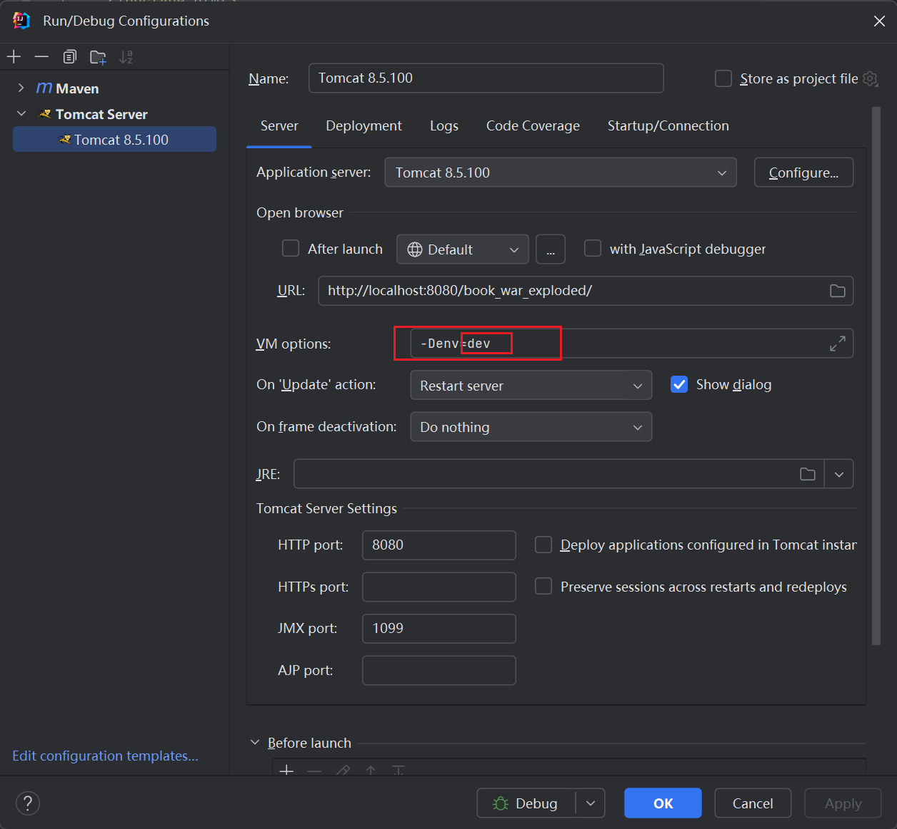

# 关于环境变量
1. 在/src/main/resources/中新增application.dev.properties
2. 填写配置
```properties
db.url=jdbc:mysql://localhost:3306/数据库名?serverTimezone=UTC
db.username=用户名
db.password=密码
```
3. 在tomcat启动配置中填写启动配置
